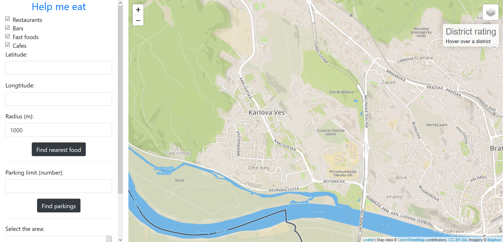
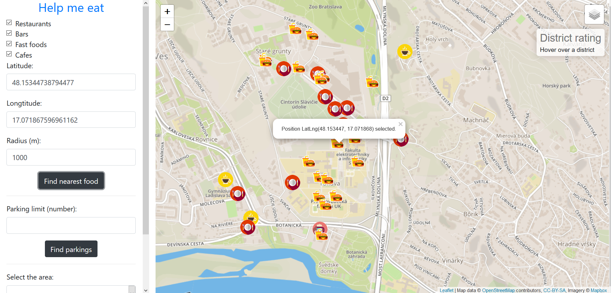
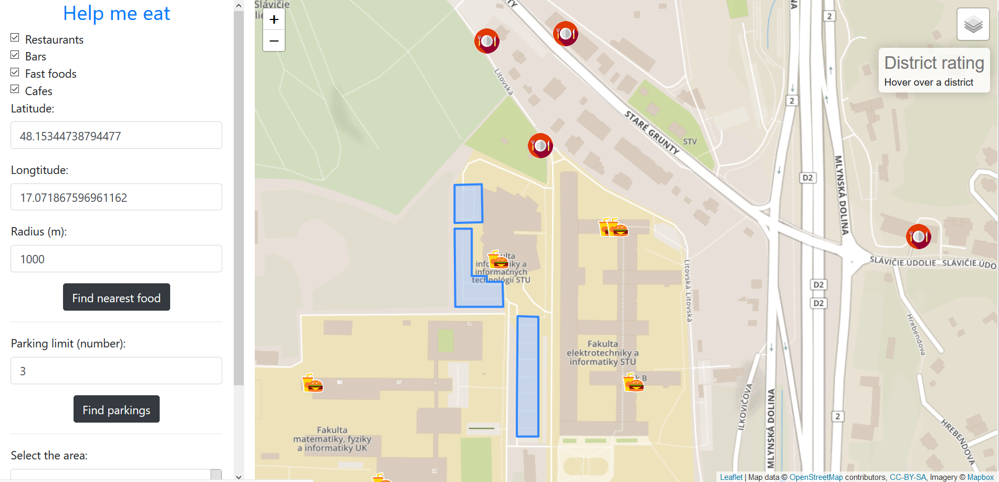
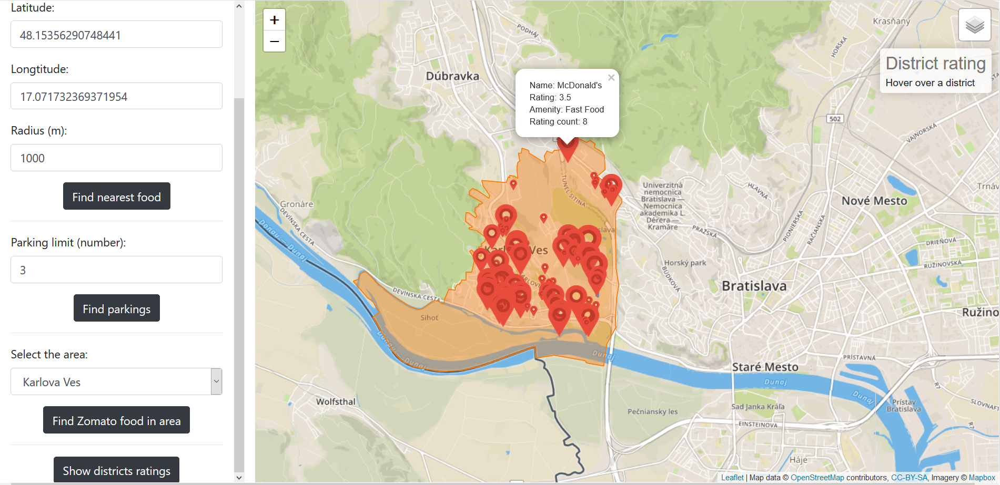
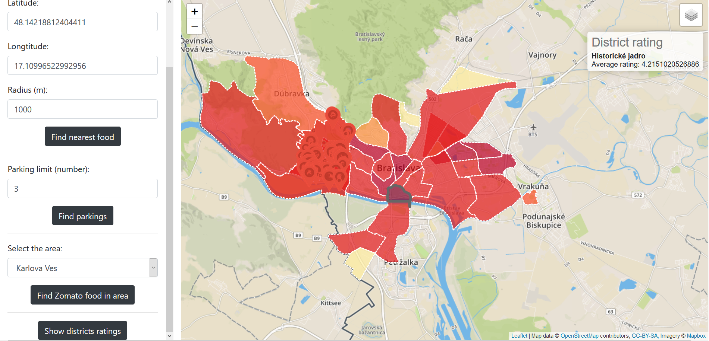

# Help me eat

**Application description**: Application's purpose is to help user find eating place of his choice and help him find parking spot in Bratislava, Slovakia. 
1. Showing the nearest restaurants/bars/cafes/fast-foods to the point of interest within selected distance.
2) The user can choose a place and find n-closest parking spots.
3) Showing selected Bratislava region on the map. User can pick a region and show spots and it's reviews. Marker size defines rating of the spot.
4) Showing all Bratislava regions on map, with aggregated weighted raging of spots in the area.

## Data sources

- [Open Street Maps](https://www.openstreetmap.org/)
- [Zomato] (https://www.zomato.com/sk/bratislava)

**Data source**: 
- https://www.openstreetmap.org - Bratislava
- https://wiki.openstreetmap.org/wiki/Cs:Tag:amenity%3Drestaurant - restaurant
- https://wiki.openstreetmap.org/wiki/Tag:amenity%3Dparking_space - parking space
- https://wiki.openstreetmap.org/wiki/Tag:boundary=administrative - districts

**Technologies used**: 
- PostGIS - https://postgis.net/
- NodeJS - https://nodejs.org/en/
- Leaflet - https://leafletjs.com/
