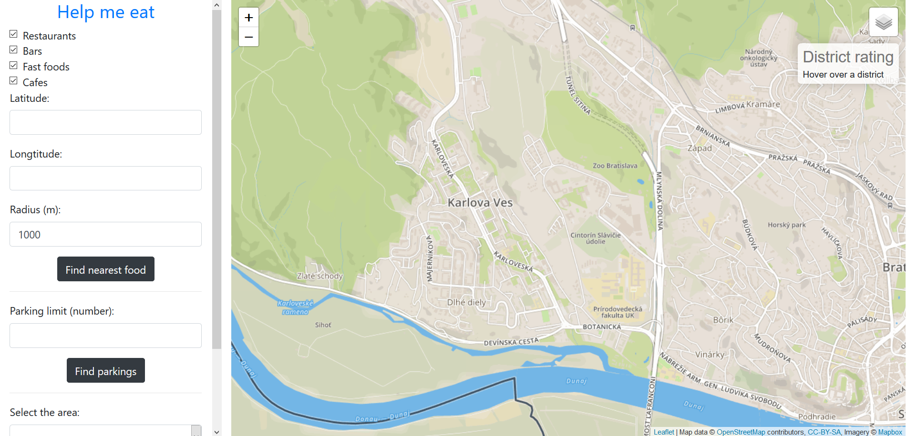
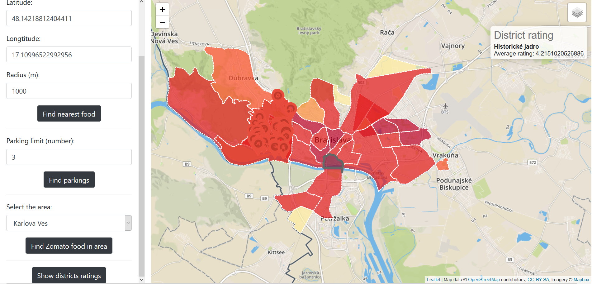

# Help me eat

## Overview

Application's purpose is to help user find eating place of his choice and help him find parking spot in Bratislava, Slovakia. 
1. Showing the nearest restaurants/bars/cafes/fast-foods to the point of interest within selected distance.
2) The user can choose a place and find n-closest parking spots.
3) Showing selected Bratislava region on the map. User can pick a region and show spots and it's reviews. Marker size defines rating of the spot.
4) Showing all Bratislava regions on map, with aggregated weighted rating of spots in the area.

- Initial State

- Show nearest restaurants/cafes/pubs/fast/foods

- Showing nearest parking spots to selected place

- Show spots in the selected Bratislava area 
- Size of point is assigned by place's rating

- Show all regions with aggregated wieghtened rating in area

## Frontend
Fronted is simple page with defined html elements in `index.html`. Javascript code with API calls and leaflet functions is defined in `my-scripts.js`. Application is built with NPM package manager. Just run `npm install` to install all dependencies.

## Backend
Backend application is written in `Node.JS` with usage of `Express` micro-framework. All dependencies are built with NPM package manager.

### Data
We used data of Bratislava from Open Street Maps. We used `osm2pgsql` to convert them to Postgres. 
We also used external data source Zomato.com. Zomato.com provides simple API to search for their restaurants. We made a simple `python` application to make 400 API Calls to `https://developers.zomato.com/api/v2.1/search`. API returns 20 nearest points to requested lat and long parameters. So we started at lat/long '48.198935/16.976767' and ended at '48.100553/17.200356'. We saved our spots from responses to .json files.

Then we created parser to parse informations from parsed fiels to Postgres. Advantage of this method was, that Zomato provides additional informations about restaurants:
- user rating
- ratings count
- restaurant cuisines

- [Open Street Maps](https://www.openstreetmap.org/)
- [Zomato] (https://www.zomato.com/sk/bratislava)

### Api

**Get nearest restaurants/bars/cafes/pubs to selected lat/long**

`GET /api/near-restaurants?lat=48.16099967327614&lng=17.06609138815438&radius=1000&types=restaurant,bar,fast_foods,cafe`

In body part of request is the information about XXX
**Get nearest parkings to osm_id of restaurant**
`GET /api/near-parking-spots?id=1930190573&limit=3`

**Get districts of Bratislava**

`GET /api/districts`

**Get restaurants from Zomato in selected area**

`GET /api/district-restaurants?district=Dlhé diely`

**Get all Bratislava districts with average rating**

`GET /api/districts-average`

**Technologies used**: 
- PostGIS - https://postgis.net/
- NodeJS - https://nodejs.org/en/
- Leaflet - https://leafletjs.com/

### Database optimalisations
