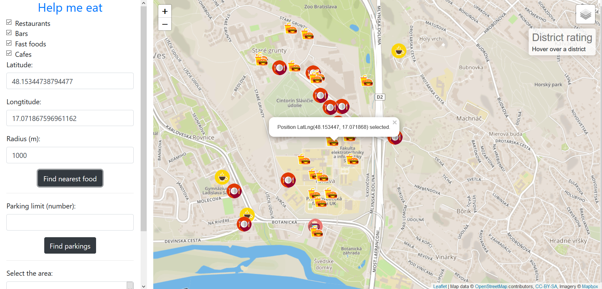
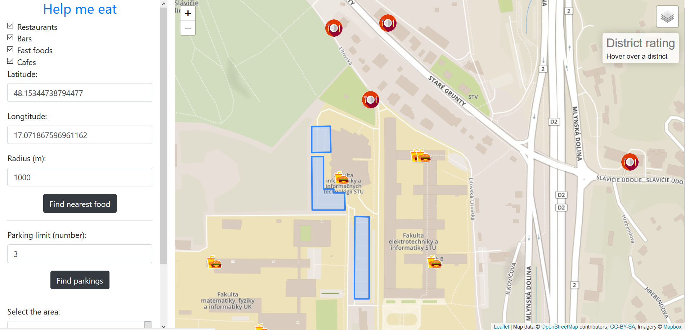
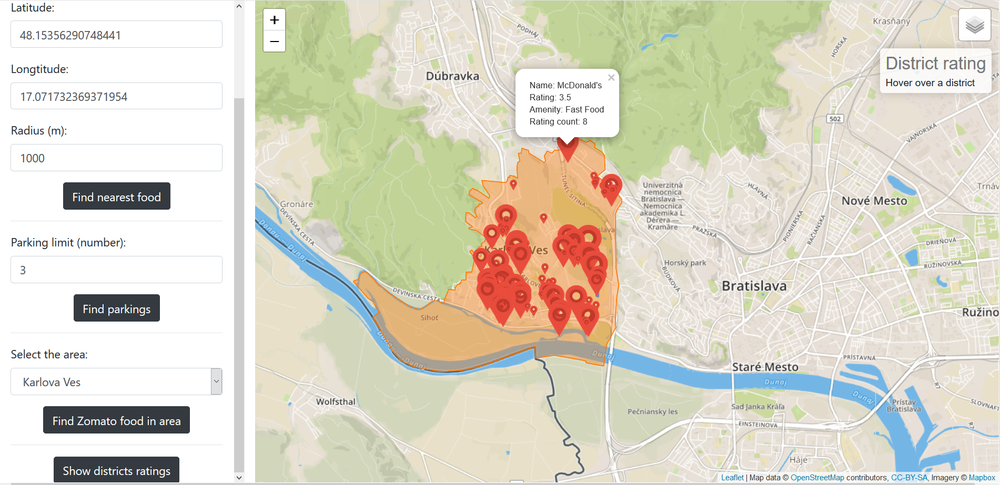

# Help me eat

## Overview

Application's purpose is to help user find eating place of his choice and help him find parking spot in Bratislava, Slovakia. 
1. Showing the nearest restaurants/bars/cafes/fast-foods to the point of interest within selected distance.
2) The user can choose a place and find n-closest parking spots.
3) Showing selected Bratislava region on the map. User can pick a region and show spots and it's reviews. Marker size defines rating of the spot.
4) Showing all Bratislava regions on map, with aggregated weighted rating of spots in the area.

- Initial State

- Show nearest restaurants/cafes/pubs/fast/foods

- Showing nearest parking spots to selected place

- Show spots in the selected Bratislava area 
- Size of point is assigned by place's rating

- Show all regions with aggregated wieghtened rating in area

## Frontend
Fronted is simple page with defined html elements in `index.html`. Javascript code with API calls and leaflet functions is defined in `my-scripts.js`. Application is built with NPM package manager. Just run `npm install` to install all dependencies.

## Backend
Backend application is written in `Node.JS` with usage of `Express` micro-framework. All dependencies are built with NPM package manager.

### Data
We used data of Bratislava from Open Street Maps. We used `osm2pgsql` to convert them to Postgres. 
We also used external data source Zomato.com. Zomato.com provides simple API to search for their restaurants. We made a simple `python` application to make 400 API Calls to `https://developers.zomato.com/api/v2.1/search`. API returns 20 nearest points to requested lat and long parameters. So we started at lat/long '48.198935/16.976767' and ended at '48.100553/17.200356'. We saved our spots from responses to .json files.

Then we created parser to parse informations from parsed fiels to Postgres. Advantage of this method was, that Zomato provides additional informations about restaurants:
- user rating
- ratings count
- restaurant cuisines

Sources:
- [Open Street Maps](https://www.openstreetmap.org/)
- [Zomato] (https://www.zomato.com/sk/bratislava/)

### Api

**Get nearest restaurants/bars/cafes/pubs to selected lat/long**

`GET /api/near-restaurants?lat=48.16099967327614&lng=17.06609138815438&radius=1000&types=restaurant,bar,fast_foods,cafe`

**Get nearest parkings to osm_id of restaurant**

`GET /api/near-parking-spots?id=1930190573&limit=3`

**Get districts of Bratislava**

`GET /api/districts`

**Get restaurants from Zomato in selected area**

`GET /api/district-restaurants?district=Dlhé diely`

**Get all Bratislava districts with average rating**

`GET /api/districts-average`

**Technologies used**: 
- PostGIS - https://postgis.net/
- NodeJS - https://nodejs.org/en/
- Leaflet - https://leafletjs.com/

### Database optimalisations
**Query1: Get nearest restaurats:**
Query cost: 13432.38

We created separated table for eating spots: spots_polygons.

`CREATE TABLE spots_polygons
  AS (
	  SELECT osm_id, way, name, amenity FROM planet_osm_polygon
	  WHERE (amenity = 'restaurant' OR amenity = 'bar' OR amenity = 'cafe' OR amenity = 'fast_food') and name!=''
  );`
  
Optimalized Query cost: 525.96

`with places as (select name, 
			   	st_distance(ST_GeographyFromText('SRID=4326;POINT(17.065029 48.162765)'), 								ST_Transform(way,4326)::geography),
			   	ST_x(ST_Transform(way,4326)) as x,
			   	ST_y(ST_Transform(way,4326)) as y
				from spots_points
				where st_distance(
				ST_GeographyFromText('SRID=4326;POINT(17.065029 48.162765)'),
				ST_Transform(way,4326)::geography)<5000
				union all
				select name, 
				st_distance(ST_GeographyFromText('SRID=4326;POINT(17.065029 						48.162765)'),ST_Transform(way,4326)::geography), 
				ST_x(ST_Transform(ST_Centroid(way),4326)) as x,
				ST_y(ST_Transform(ST_Centroid(way),4326)) as y
				from spots_polygons
				where st_distance(
				ST_GeographyFromText('SRID=4326;POINT(17.065029 48.162765)'),
				ST_Transform(way,4326)::geography)<5000
					)
				select * from places ORDER by st_distance`
				
			
  
**Query2: Get nearest parking spots:**
Query cost: 3199.43..8929.73

We created separated table for parking spots: 

`CREATE TABLE parkings_polygons
AS (SELECT osm_id,name,way FROM planet_osm_polygon
WHERE amenity like 'parking');`

Optimalized Query cost: 624.69..6236.32

`WITH restaurants AS
(
SELECT osm_id, name, way FROM spots_points WHERE osm_id IN (1930190573)
UNION ALL
SELECT osm_id, name, way FROM spots_polygons WHERE osm_id IN (1930190573)
),
parkings AS
(
SELECT osm_id,name,way FROM parkings_polygons
),
distances AS
(
SELECT p.osm_id, ST_DISTANCE(ST_Transform(r.way,26986),ST_Transform(p.way,26986)) FROM restaurants r, parkings p
),
closest AS
(
SELECT osm_id, SUM(st_distance) from distances
GROUP BY osm_id
ORDER BY SUM(st_distance) ASC
LIMIT 1
)									 
SELECT osm_id, ST_AsGeoJSON(ST_Transform(way, 4326))						 
FROM ((SELECT osm_id,way, name 
FROM parkings
WHERE osm_id IN 
(SELECT osm_id 
from closest LIMIT 5))
UNION ALL
(SELECT osm_id,way, name 
FROM parkings
WHERE osm_id IN (SELECT osm_id 
FROM closest OFFSET 1))
) as querina`

**Query3: Eating spots in area:**
Query cost: 0.29..458.84

We created separated table for administrative_polygons:

`CREATE TABLE administrative_polygons
AS (SELECT name, way, admin_level FROM planet_osm_polygon 
WHERE boundary like 'administrative');`

We created index on name of area.

`CREATE INDEX ON administrative_polygons(name)`

Optimalized Query cost:
cost=0.14..458.69

`SELECT name, x, y, rating_avg, rating_count, amenity
FROM
(
SELECT st_intersects(ST_Transform(poly.way,4326), restaurants.path) AS intersects, restaurants.name, restaurants.amenity, ST_x(ST_Transform(restaurants.path,4326)) as x, ST_y(ST_Transform(restaurants.path,4326)) as y, rating_avg, rating_count
FROM administrative_polygons as poly
CROSS JOIN restaurants
WHERE poly.name LIKE 'Karlova Ves'
) as districts
WHERE intersects=true and districts.name is not null`

**Query 4: Get aggregated rating in areas:**
Query time: 5s

We created new column in administrative_polygons, where we inserted transfomed data.

`UPDATE administrative_polygons
SET way4326 = ST_Transform(way,4326)`

New Query time: 1s

`SELECT district, st_asgeojson, sum(rating_avg * rating_count) / (sum(rating_count)+1) as rating_average
FROM
(
SELECT st_intersects(ST_Transform(poly.way,4326), restaurants.path) AS intersects, poly.name as district, restaurants.name, rating_avg, rating_count, ST_AsGeoJSON(ST_Transform(way, 4326)) AS st_asgeojson
FROM administrative_polygons as poly
CROSS JOIN restaurants
WHERE poly.admin_level LIKE '10'
) as districts
WHERE intersects=true and districts.name is not null
GROUP BY district, st_asgeojson`

